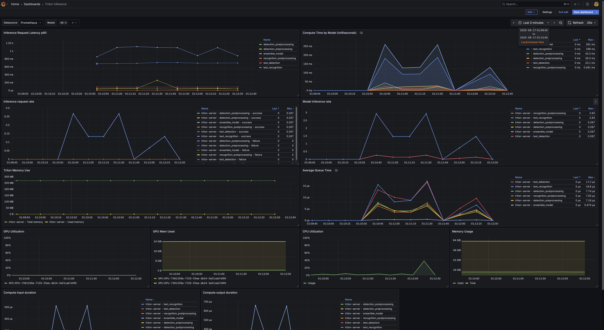

A high-performance OCR (Optical Character Recognition) solution powered by PaddleOCR and NVIDIA Triton Inference Server, designed for scalable text detection and recognition in production environments.

## Table of Contents

- [Key Features](#key-features)
- [Getting Started](#getting-started)
  - [1. Start the Services](#1-start-the-services)
  - [2. Test OCR Inference](#2-test-ocr-inference)
  - [3. Access Monitoring Dashboards](#3-access-monitoring-dashboards)
- [Monitoring & Observability](#monitoring--observability)
  - [Grafana Dashboard Demo](#grafana-dashboard-demo)
  - [Additional Information](#additional-information)
- [TODO](#todo)
  - [🔧 Optimization & Performance](#-optimization--performance)
- [References](#references)

## Key Features

- 🚀 **High-Performance**: NVIDIA Triton Server + ONNX Runtime with dynamic batching
- 🔍 **Advanced OCR**: PaddleOCR PP-OCRv3 models for text detection & recognition
- 🏗️ **Modular Pipeline**: 5-stage OCR pipeline based on [PaddleOCR](https://github.com/PaddlePaddle/PaddleOCR) (preprocessing → detection → postprocessing → recognition → output)
- 📊 **Monitoring**: Prometheus metrics + Grafana dashboards for production monitoring
- 🛠️ **Easy Deploy**: Docker containerization with gRPC/HTTP client support
- ⚡ **Scalable**: Supports batch processing and multi-instance deployment for high throughput  
- 🔧 **Production-Ready**: Enterprise-grade deployment with monitoring, metrics, and containerized architecture

## Getting Started

### 1. Start the Services
```bash
docker compose up -d
```

This will start:
- **Triton Inference Server** 
- **OCR Client API** exposing the FastAPI service on <http://localhost:8080>
- **Prometheus** for metrics collection
- **Grafana** for monitoring dashboards

### 2. Test OCR Inference
You can now call the OCR API directly through the containerised FastAPI service:

```bash
curl -X POST "http://localhost:8080/infer" \
  -H "accept: application/json" \
  -H "Content-Type: multipart/form-data" \
  -F "file=@workspace/img_12.jpg"
```

For testing the Triton ensemble pipeline, you can execute the standalone Python client inside `workspace/` to call the ensemble model directly instead of using the client-side pipeline:

```bash
pip install numpy opencv-python-headless tritonclient[all]
cd workspace
python3 client.py --image=img_12.jpg --url=localhost:8001
```

### 3. Access Monitoring Dashboards

After services are running, access the monitoring interfaces:

- **Prometheus:** <http://localhost:9090>
- **Grafana:** <http://localhost:3000> (admin/admin)

## Monitoring & Observability

After the containers start, access the dashboards:

- **Prometheus:** <http://localhost:9090>
- **Grafana:** <http://localhost:3000> 
  - **Username**: `admin`
  - **Password**: `admin`

In Grafana, add a Prometheus data source at `http://prometheus:9090` and import the "Triton Inference Server" dashboard from the [triton-inference-server/server](https://github.com/triton-inference-server/server/tree/main/qa/metrics) repository.

### Grafana Dashboard Demo



The dashboard provides real-time monitoring of:
- **Inference Performance**: Request latency, and queue time
- **Model Metrics**: Success/failure rates
- **Resource Utilization**: CPU, memory, and GPU usage (when enabled)

### Additional Information

Metrics are enabled with the following flags when starting `tritonserver`:
```bash
--allow-metrics=true
--allow-gpu-metrics=true
--metrics-config summary_latencies=true
```

## TODO

### 🔧 **Optimization & Performance**
- [ ] Benchmark: perf_analyzer/model-analyzer
- [ ] Optimize with TensorRT integration for faster inference
- [ ] Model quantization (INT8/FP16) for reduced memory usage


## References

This project is built based on NVIDIA Triton Inference Server concepts and PaddleOCR:

- **NVIDIA Triton Conceptual Guides**: [triton-inference-server/tutorials/Conceptual_Guide](https://github.com/triton-inference-server/tutorials/tree/main/Conceptual_Guide)
- **Triton Metrics Documentation**: [NVIDIA Triton Metrics User Guide](https://docs.nvidia.com/deeplearning/triton-inference-server/user-guide/docs/user_guide/metrics.html)
- **PaddleOCR**: [PaddlePaddle/PaddleOCR](https://github.com/PaddlePaddle/PaddleOCR) - A powerful OCR toolkit supporting 80+ languages with PP-OCRv5, PP-StructureV3, and PP-ChatOCRv4


